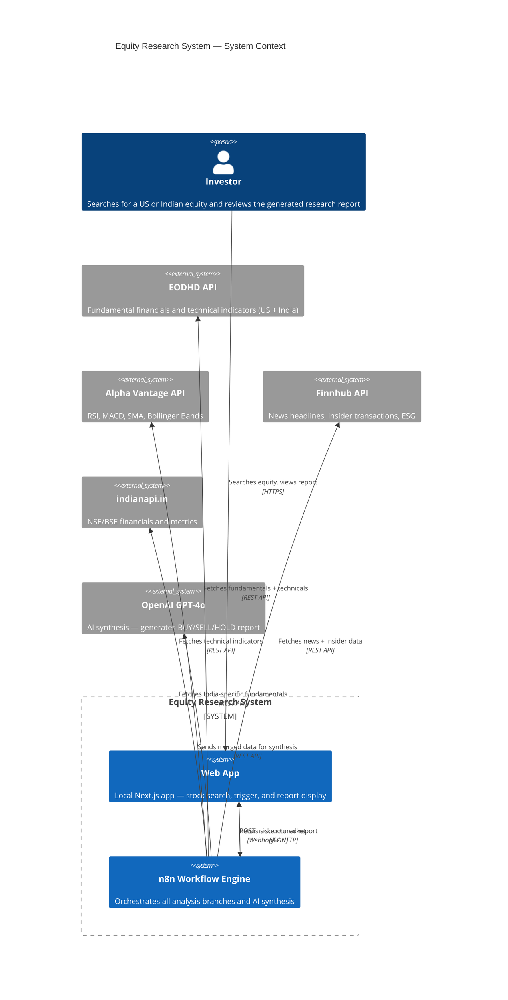
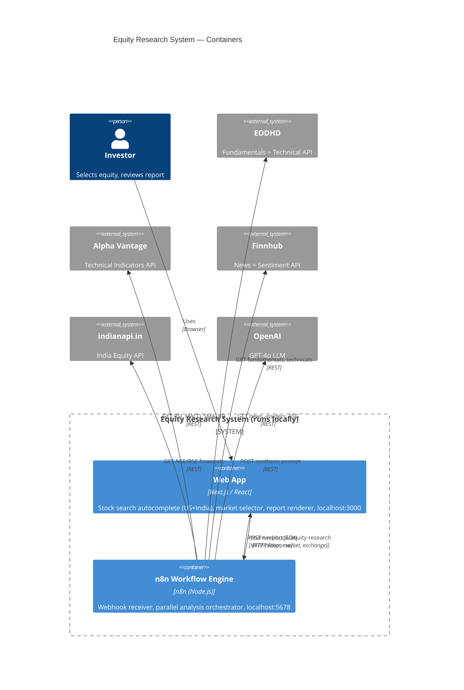
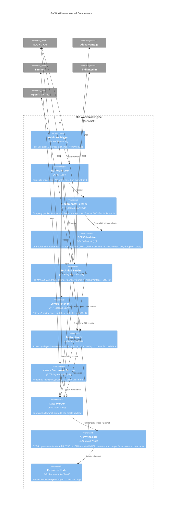

# Equity Research System — Implementation Plan

An institutional-grade equity research tool: local Next.js web app + n8n workflow covering US and Indian equities.

---

## C4 Architecture Diagrams

### Level 1 — System Context



---

### Level 2 — Container Diagram



---

### Level 3 — n8n Workflow Component Diagram



---

## ⚠️ Honest API Evaluation

### Fundamental Data

| API | Data Quality | India Support | Free Tier | Verdict |
|---|---|---|---|---|
| **Intrinio** | ⭐⭐⭐⭐⭐ Best-in-class, validated by AI/ML pipelines, direct exchange sourcing | Limited | No (starts ~$50/mo) | 🥇 Best quality, worth paying |
| **Financial Modeling Prep (FMP)** | ⭐⭐⭐ Has known accuracy issues in 2024 — missing historical data, share count errors, negative revenue bugs | Yes (`.NS`/`.BO`) | 250 req/day | ⚠️ Popular but unreliable — use with caution |
| **EODHD** | ⭐⭐⭐⭐ Strong historical + global coverage, India included | Yes | Limited free tier | 🥈 Good alternative to FMP |
| **Yahoo Finance (yfinance)** | ⭐⭐ Unofficial scraping wrapper, rate limits, data gaps, unreliable | Yes (global) | Free | ❌ Not for production — fine for prototyping only |
| **Finnhub** | ⭐⭐⭐⭐ Strong for US fundamentals and real-time data | Partial India | 60 req/min free | 🥈 Good for US, limited for India |

> [!IMPORTANT]
> **FMP has documented data quality issues** (Reddit/Trustpilot, 2024): missing historical share counts, incorrect revenue figures, gaps in historical data. For research you're basing real investment decisions on, this matters.

### Price & Technical Data

| API | Data Quality | India Support | Free Tier | Verdict |
|---|---|---|---|---|
| **Polygon.io** | ⭐⭐⭐⭐⭐ Best for US — nanosecond precision, direct exchange feeds | US only | 5 calls/min | 🥇 Best for US technical data |
| **Alpha Vantage** | ⭐⭐⭐⭐ Solid, 50+ built-in indicators (RSI, MACD, BB), 20yr history | Yes (`.BSE`/`.NSE`) | 25 req/day | 🥈 Great free option, includes indicators |
| **EODHD Technical API** | ⭐⭐⭐⭐ SMA, EMA, RSI, MACD, Stochastic — India + global | Yes | Free sign-up | 🥈 Strong India technical coverage |
| **Yahoo Finance (yfinance)** | ⭐⭐ Gaps, zeros in historical OHLC, rate limits | Yes | Free | ❌ Not reliable enough for technical signals |

### India-Specific

| API | What it provides | Verdict |
|---|---|---|
| **indianapi.in** | NSE + BSE: real-time prices, financials, key metrics, analyst views | ✅ Solid India-specific option |
| **Zerodha Kite Connect** | Live streaming data — needs a Zerodha account, reported live data inconsistencies | ⚠️ Good for live price, not fundamentals |
| **NSE official data** | Most accurate, but no public API — paid feeds via authorised vendors | 💰 Overkill for research tool |
| **Screener.in** | Great India fundamentals UI, limited API access | 🔍 Good for manual cross-checking |

---

## Recommended API Stack

Given you want accuracy and are making real investment decisions:

### Option A — Free (Good enough to start)
| Purpose | API | Notes |
|---|---|---|
| US Fundamentals | **EODHD** | Better accuracy than FMP, decent free tier |
| India Fundamentals | **indianapi.in** + **EODHD** | indianapi.in for India-specific data |
| US Technical | **Alpha Vantage** | Built-in RSI/MACD/BB/SMA, 25 req/day |
| India Technical | **EODHD Technical API** | Free sign-up, good India coverage |
| News / Insider | **Finnhub** | 60 req/min free, US + partial India |
| AI Synthesis | **OpenAI GPT-4o** | ~$0.01/report |

### Option B — Paid (Institutional grade)
| Purpose | API | Cost |
|---|---|---|
| US + India Fundamentals | **Intrinio** | ~$50–100/mo |
| US Technical | **Polygon.io** (Starter) | ~$29/mo |
| India Technical | **EODHD** (paid) | ~$20/mo |
| News | **Finnhub** (Premium) | ~$50/mo |

> [!TIP]
> Start with **Option A** to build and test the system. Upgrade individual APIs to Option B as you identify gaps in specific data points. The n8n workflow makes it easy to swap one HTTP node for another.

---

## Architecture (unchanged)

```
WEB APP (localhost:3000)
  └── Search US (NYSE/NASDAQ) + India (NSE/BSE)
  └── Trigger n8n on equity selection
  └── Display structured report

n8n WORKFLOW
  ├── Branch 1: Fundamental (EODHD + indianapi.in)
  ├── Branch 2: DCF - 3 scenarios (Code node)
  ├── Branch 3: Technical (Alpha Vantage + EODHD)
  ├── Branch 4: Comps (EODHD peer data)
  ├── Branch 5: Factor Scoring (computed from above)
  └── Branch 6: News + Insider (Finnhub)
          └── GPT-4o Synthesis
          └── Structured Report → Web App
```

---

## Analysis Branches (same as before)

### 1 — Fundamental (EODHD + indianapi.in)
Income statement, balance sheet, cash flow, key ratios, analyst consensus — last 5 years annual + 4 quarters.

### 2 — DCF (3 Scenarios — Code Node)
| Scenario | FCF Growth | Terminal Growth | WACC |
|---|---|---|---|
| 🐂 Bull | Historical CAGR | +0.5% | −1% |
| 📊 Base | CAGR × 0.8 | Standard | Standard |
| 🐻 Bear | CAGR × 0.5 | −0.5% | +1% |

WACC: 🇺🇸 US (Rf=4.5%, ERP=5.5%) | 🇮🇳 India (Rf=7%, ERP=6.5%)  
Output: Intrinsic value/share + margin of safety per scenario + sensitivity table.

### 3 — Technical (Alpha Vantage / EODHD)
RSI, MACD, SMA 50/200, Bollinger Bands, volume trend analysis.

### 4 — Comps
Auto-fetch 5 sector peers → build EV/EBITDA, P/E, P/FCF, P/S multiples table → implied value range.

### 5 — Factor Scoring (Code Node)
Score 1–10 on: Quality (ROIC/WACC, FCF margin), Value (FCF yield, EV/EBITDA percentile), Momentum (3/6/12-mo returns), Growth (revenue + EPS CAGR), Earnings Quality (accruals ratio).

### 6 — News + Ownership (Finnhub)
Headlines, insider buys/sells, short interest, ESG score, upcoming earnings.

---

## GPT-4o Synthesis Output
1. Signal: BUY / SELL / HOLD + Conviction
2. Fair Value Range (DCF base + comps blend)
3. Factor Scorecard
4. Fundamental summary (5 bullets)
5. DCF commentary + sensitivities
6. Technical setup
7. Comps positioning
8. Key Risks (3) + Catalysts (3)
9. Entry / Stop-Loss / Target (if BUY)
10. Investment Narrative (3 paragraphs)

---

## API Keys to Get

| API | Link | Cost |
|---|---|---|
| EODHD | https://eodhd.com | Free tier available |
| Alpha Vantage | https://www.alphavantage.co/support/#api-key | Free |
| indianapi.in | https://indianapi.in | Free tier |
| Finnhub | https://finnhub.io | Free (60 req/min) |
| OpenAI | https://platform.openai.com/api-keys | Pay-per-use |

---

## Implementation Order

| Step | What | Day |
|---|---|---|
| 1 | n8n webhook + EODHD fundamental nodes | 1 |
| 2 | DCF Code node (3 scenarios) | 1 |
| 3 | Technical indicator nodes | 1 |
| 4 | Comps + Factor scoring | 2 |
| 5 | News / Insider / ESG nodes | 2 |
| 6 | GPT-4o synthesis node | 2 |
| 7 | Next.js web app | 3 |
| 8 | End-to-end test: AAPL (US) + RELIANCE (India) | 3 |
